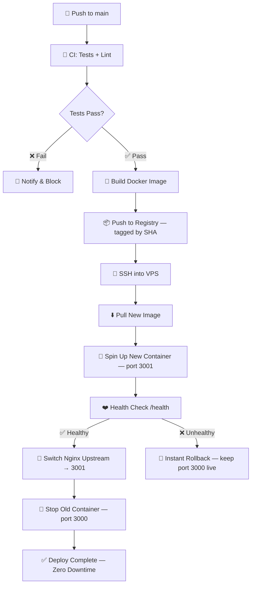
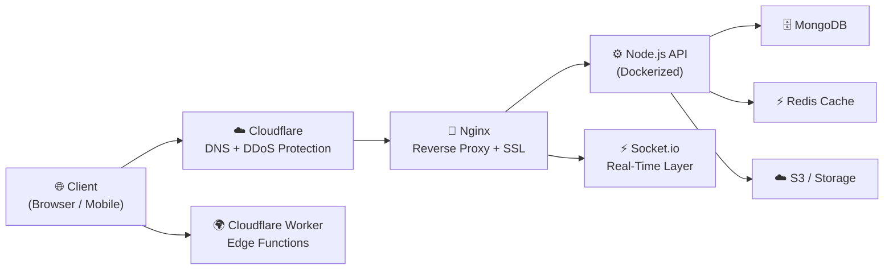

<div align="center">


&nbsp;

<p>


</p>

[](https://raahulmehta.online)
[](https://www.linkedin.com/in/rahul-mehta-811003320)
[](https://www.upwork.com/freelancers/raahulmehta)
[](mailto:raahulmehta@icloud.com)
[](https://www.instagram.com/raahulmehta_)
[](https://x.com/whoisrahulmehta)
[](https://www.snapchat.com/add/whoisrahulmehta)
[](https://www.facebook.com/mehta.rahul.rm007)

</div>

---

## 💫 About Me

I'm a **Full-Stack Developer** who doesn't just build applications — I craft **immersive digital experiences** that blend stunning animations with robust, production-grade infrastructure.

**My Journey:** Started as a React developer, evolved into a complete full-stack engineer handling **frontend magic, backend architecture, deployment pipelines, and cross-platform mobile development**.

#### What I Do:
- 🎨 Create **animated, interactive websites** using **GSAP**, **Three.js**, and **Framer Motion**
- 📱 Build **cross-platform mobile applications** with **React Native**
- ⚡ Develop **real-time systems** using **Socket.IO** — chat, live analytics, notifications
- 🏗️ Architect **scalable backends** with **Node.js**, **Express**, **NestJS**, and **MongoDB**
- 🎯 Design **pixel-perfect UIs** with **Tailwind CSS**, **Material-UI**, and **SCSS**
- 🚀 Handle complete **production-grade deployment pipelines** — Docker, Kubernetes, CI/CD, Nginx, zero-downtime systems
- 🌐 Deploy to **AWS, Cloudflare Workers, VPS, Vercel** with SSL and domain management
- 📊 Build **custom CMS/CRM solutions** and admin panels
- 💳 Integrate **payment gateways** — Stripe, PayPal, Razorpay
- 🤖 Build **WhatsApp Business bots** using Meta Cloud API with webhook + AI pipelines

#### Currently:
- 🔭 Working on **enterprise marketplace applications** and **real-time analytics systems**
- 🌱 Deep diving into **Kubernetes**, **Caddy**, and **advanced CI/CD patterns**
- 🎯 Speciality: animations that make people say *"wait, how did they do that?"*
- ⚡ Portfolio: [raahulmehta.online](https://raahulmehta.online)
- 📫 **raahulmehta@icloud.com**

> *"From concept to deployment — I build digital experiences that ship, scale, and feel alive."*

---

## ⚡ Advanced Capabilities

- 🧠 **Real-time systems at scale** (WebSockets, event-driven flows)
- 🐳 **Container orchestration-ready architecture**
- 🔄 **Zero-downtime production deployments**
- 📦 **Monorepo & multi-service CI/CD pipelines**
- 🌐 **Edge + server hybrid systems**
- ⚡ **High-performance animation pipelines (GSAP + WebGL)**

> I focus on building systems that are **fast, reliable, and production-ready from day one.**

---

## 🏗️ Featured Architecture Case Study

### Vetrinamia — Real-Time Analytics & Shopify Integration Platform

> A production system handling live WebSocket streams, real-time admin dashboards, and load-balanced VPS infrastructure.

```
┌─────────────────────────────────────────────────────────────────────┐
│                        PRODUCTION SYSTEM                            │
│                                                                     │
│   Browser / Admin Dashboard                                         │
│        │  WebSocket (Socket.io)                                     │
│        ▼                                                            │
│   ┌──────────┐     ┌──────────────┐     ┌──────────────────────┐  │
│   │  Nginx   │────▶│  Node.js     │────▶│  MongoDB             │  │
│   │  Reverse │     │  API Server  │     │  (Analytics Store)   │  │
│   │  Proxy   │     │  (Dockerized)│     └──────────────────────┘  │
│   │  + SSL   │     │              │     ┌──────────────────────┐  │
│   └──────────┘     │  Socket.io   │────▶│  Redis               │  │
│        │           │  WS Handler  │     │  (Session / Cache)   │  │
│        │           └──────────────┘     └──────────────────────┘  │
│        │                  │                                         │
│        │           ┌──────────────┐                                 │
│        │           │  Shopify     │                                 │
│        │           │  Marketplace │                                 │
│        │           │  Integration │                                 │
│        │           └──────────────┘                                 │
│        │                                                            │
│   GitHub Actions CI/CD                                              │
│   push → test → build image → SSH deploy → health check → live     │
└─────────────────────────────────────────────────────────────────────┘
```

**Key Engineering Decisions:**
- 🔄 **Blue-Green deployments** via Nginx upstream switching — zero user impact during releases
- 📦 **Immutable Docker images** — tagged by git SHA, pushed to registry, pulled on VPS
- ⚡ **WebSocket streams** — live analytics events pushed server → client at sub-100ms latency
- 🛡️ **Health-check driven releases** — new container must pass `/health` before traffic switches

---

## 🏗️ Production Architecture

I don't just deploy apps — I design **resilient, scalable production systems**.

### ⚡ CI/CD Deployment Flow



### 🌐 System Architecture — Multi-Service Backend



### 🔁 Blue-Green Deployment Strategy

```
Production VPS
├── Nginx (port 80/443)
│     └── upstream: points to ACTIVE container
│
├── 🟢 Container GREEN  (port 3000) ← ACTIVE / receives traffic
└── 🔵 Container BLUE   (port 3001) ← STANDBY / warming up

Deploy steps:
  1. Start BLUE on 3001 with new image
  2. Health check BLUE at /health
  3. Nginx upstream → 3001  (atomic swap)
  4. Stop GREEN
  5. GREEN becomes next STANDBY
```

---

## 🧠 CI/CD Philosophy

My approach to CI/CD is simple:

- ✅ Every commit should be **deployable**
- ✅ Deployments should be **automated, repeatable, and reversible**
- ✅ Infrastructure should be **version-controlled**
- ✅ Systems should **fail gracefully, not catastrophically**

### 🔁 Pipeline Principles

- Test before build
- Build once, deploy everywhere
- Immutable Docker images
- Health-check driven releases
- Instant rollback capability

### ⚙️ Tools I Use

- GitHub Actions for CI/CD automation
- Docker for consistent environments
- Nginx for traffic control and SSL termination
- VPS / Cloud for flexible, cost-effective deployments

> *"Good developers write code. Great developers ship reliably."*

---

## 🛠️ Tech Arsenal

<div align="center">

#### ⚡ Frontend


#### 🎨 Animation, 3D & Styling


#### 🔧 Backend & Real-Time


#### 🗄️ Database & Storage


#### 🚀 DevOps, Cloud & Production Systems


- 🐳 **Docker-first Architecture** — containerized apps with multi-stage builds
- 🔄 **CI/CD Pipelines** via GitHub Actions — test → build → push → deploy
- ⚡ **Zero Downtime Deployments** — Blue-Green strategy with traffic switching
- 🌐 **Nginx Reverse Proxy** — load balancing, SSL termination, routing
- 🔐 **SSL Automation** — Let's Encrypt with auto-renewal
- ☸️ **Kubernetes (Learning & Scaling)** — orchestration-ready architecture
- 🧠 **Deployment Strategy Design** — rollback systems, health checks, versioning
- 🌍 **Multi-Environment Deployments** — staging, production, preview
- ⚡ **Edge Deployments** — Cloudflare Workers, low-latency APIs
- 📊 **Monitoring & Logging** — PM2, CloudWatch, runtime observability

> I build systems that **don't just deploy — they recover, scale, and evolve.**

#### 🧰 Tools, Integrations & Platforms


</div>

---

## 💼 What I Offer

#### Full-Stack Development Services:
- ✅ **Full Stack Web Development** — MERN / MEAN Stack
- ✅ **Next.js & React Applications** with server-side rendering
- ✅ **Real-time Applications** — Socket.IO, WebRTC, Chat Systems
- ✅ **E-commerce & Marketplace Development** with payment integration
- ✅ **Payment Gateway Integration** — Stripe, PayPal, Razorpay
- ✅ **API Development & Third-party Integration** — REST, GraphQL
- ✅ **Database Design & Optimization** — SQL & NoSQL
- ✅ **Mobile App Development** — React Native (iOS + Android)
- ✅ **Cloud Deployment & DevOps** — AWS, VPS, Docker, Kubernetes
- ✅ **Domain & SSL Management** with complete hosting solutions
- ✅ **CI/CD Pipeline Setup** — GitHub Actions automated deployments
- ✅ **Performance Optimization** and scalability consulting
- ✅ **Custom CRM & ERP Solutions** for business automation
- ✅ **WhatsApp Business Bots** — Meta Cloud API, webhook handlers, AI response pipelines

#### DevOps & Deployment Expertise:
- 🚀 **AWS Cloud Services** — EC2, S3, RDS, Lambda, CloudFront, Amplify
- 🐳 **Docker Containerization** with multi-stage builds
- ☸️ **Kubernetes** cluster setup, workload and service management
- 🔄 **CI/CD Pipelines** via GitHub Actions — build, test, deploy
- 🌐 **VPS Management** — Ubuntu, Linux server administration
- 📦 **Vercel & Netlify** deployments with custom domains
- 🔧 **Nginx & Caddy** reverse proxy, load balancing, SSL termination
- 📊 **Monitoring & Logging** — PM2, CloudWatch
- 🔐 **SSL/TLS Certificate Management** — Let's Encrypt, Cloudflare

#### Deployment Solutions I Provide:
- 🌐 **Complete Domain Management** — Registration, DNS configuration, SSL
- 🚀 **Production-Ready Deployments** — Staging to live environments
- 📊 **Performance Monitoring** — Real-time monitoring and alerting
- 🔄 **Automated CI/CD Pipelines** — GitHub Actions, zero-downtime deploys

---

## 🎯 Professional Experience & Projects

## 📋 Client Work

> 15 contracts · newest first

| # | Client | What I built | Stack | Period |
|---|--------|-------------|-------|--------|
| 01 | [**Bornvia**](https://www.bornvia.com) | GSAP scroll-driven animations integrated into Framer via custom code components | `Framer` `GSAP` `ScrollTrigger` | Feb 2026 |
| 02 | **TSTN** | Rewards & loyalty system, landing page, dashboard UI with animations | `GSAP` | Feb 2026 |
| 03 | [**Flowpouch**](https://flowpouch.com) | Cloudflare Worker integrating ProsperStack with FlowPouch subscription workflow — improving retention pipelines | `Cloudflare Workers` `Hono` `Wrangler` | Jan–Feb 2026 |
| 04 | **WhatsApp AI Bot** | Webhook-based WhatsApp Business bot — Meta Cloud API, edge-deployed, handles personal assistant tasks and business queries via manual AI workflow pipelines | `Meta Cloud API` `Cloudflare Workers` `Hono` `Wrangler` | Feb 2026 |
| 05 | [**iCreate Media**](https://icmnext.vercel.app) | Agency website — GSAP scroll-triggered animations, Three.js 3D scenes, SEO-optimised, fully responsive | `Next.js` `GSAP` `Three.js` `Tailwind` | Dec 2025–Jan 2026 |
| 06 | [**LYM Digital**](https://lymdigital.com) | High-performance agency site — GSAP scroll animations, Vercel serverless contact forms, Next.js SEO | `Next.js` `GSAP` `Framer Motion` | Dec 2025–Jan 2026 |
| 07 | **Fertility Minds** `📱` | Cross-platform app — Apple/Google auth, Stripe subscriptions, real-time Socket.io chat, push notifications, social posting, custom CMS/CRM + React admin panel | `React Native` `Node.js` `MongoDB` `Socket.io` `Stripe` | Oct 2025–Feb 2026 |
| 08 | [**Al Khaleej Takaful (AKTI)**](https://www.alkhaleej.com) | Bilingual EN/AR insurance platform — RTL/LTR, complex state-persistent multi-step form, React Hook Form validation, smooth animations | `Vite` `React` `Tailwind` `GSAP` `i18n` | Aug–Dec 2025 |
| 09 | **Trade Assurance** | Global trade platform — secure auth, order management, multi-step product/service listing, real-time notifications, admin dashboards | `Next.js` `Express` `MongoDB` `Tailwind` | Jul 2025–Feb 2026 |
| 10 | [**Vetrinamia**](https://vetrinamia.com) | Real-time analytics engine — WebSocket streams, live admin dashboard, Shopify marketplace integration, load-balanced VPS with NGINX | `MERN` `WebSockets` `NGINX` `Shopify` | Jul–Aug 2025 |
| 11 | [**Trans WeGo**](https://www.transwego.ch) | Switzerland–Germany logistics platform — shipment bidding, cost-sharing algorithm, Google Maps geo-aggregation, real-time push + group chat | `Next.js` `Node.js` `MongoDB` `Socket.io` `Google Maps` | Nov 2024–Jun 2025 |
| 12 | [**Connect You**](https://connectyou.global) | Global coaching platform — Stripe, real-time chat, Google Maps + Calendar, HubSpot, timezone-based slot booking, payout & refund workflows, VPS deploy | `MERN` `Next.js` `Socket.io` `Stripe` `HubSpot` | Aug 2024–Sep 2025 |
| 13 | **Yacht Buddy** | Frontend with advanced scroll animations and interactions | `React` `GSAP` | Sep 2024 |
| 14 | **Supertiny Marketing Agency** | Dev agency portfolio — GSAP animations, VPS deploy, SEO optimised | `React` `Vite` `Tailwind` `GSAP` | Sep 2024 |
| 15 | [**NaveesInfoTeech**](https://naveesinfotech.com/) | Marketing agency portfolio — GSAP animations, VPS deploy, lead-gen optimised | `React` `Vite` `Tailwind` `GSAP` | Aug 2024 |

---

## 🌟 Speciality Work

<table>
<tr>
<td width="25%" align="center">

**🌐 3D Web & WebGL**

Three.js scenes, particle systems, shader animations, scroll-linked 3D — immersive web experiences

</td>
<td width="25%" align="center">

**✨ Scroll Animations**

GSAP ScrollTrigger timelines, pin-scrub sequences, Framer Motion transforms — websites that tell stories

</td>
<td width="25%" align="center">

**⚡ Real-Time Systems**

Socket.io chat, live analytics, push notifications, WebSocket streams, presence indicators

</td>
<td width="25%" align="center">

**🐳 Container DevOps**

Docker + Kubernetes, GitHub Actions CI/CD, Nginx + Caddy, zero-downtime production deploys

</td>
</tr>
</table>

---

## 🤝 Let's Connect

<div align="center">

[](https://raahulmehta.online)
[](https://www.upwork.com/freelancers/raahulmehta)
[](https://www.linkedin.com/in/rahul-mehta-811003320)
[](mailto:raahulmehta@icloud.com)
[](https://www.instagram.com/raahulmehta_)
[](https://x.com/whoisrahulmehta)
[](https://www.snapchat.com/add/whoisrahulmehta)
[](https://www.facebook.com/mehta.rahul.rm007)

</div>

---

<div align="center">

### 💡 *"Code is like humor. When you have to explain it, it's bad."* — Cory House


**© 2026 Rahul Mehta**

</div>


